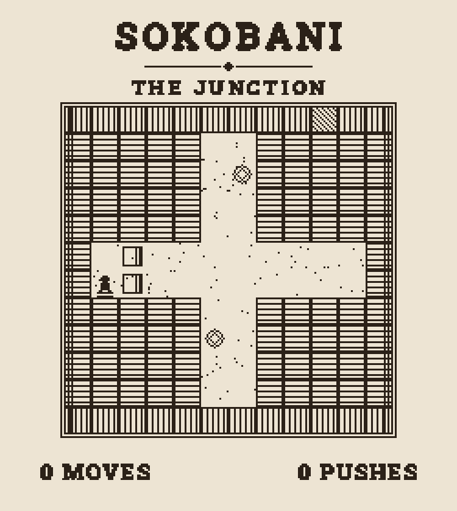
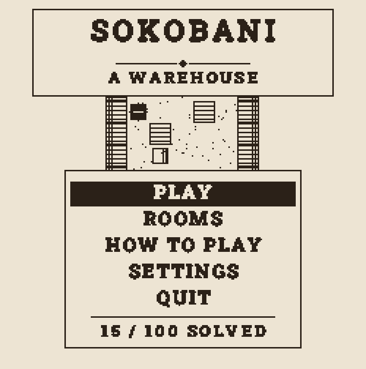
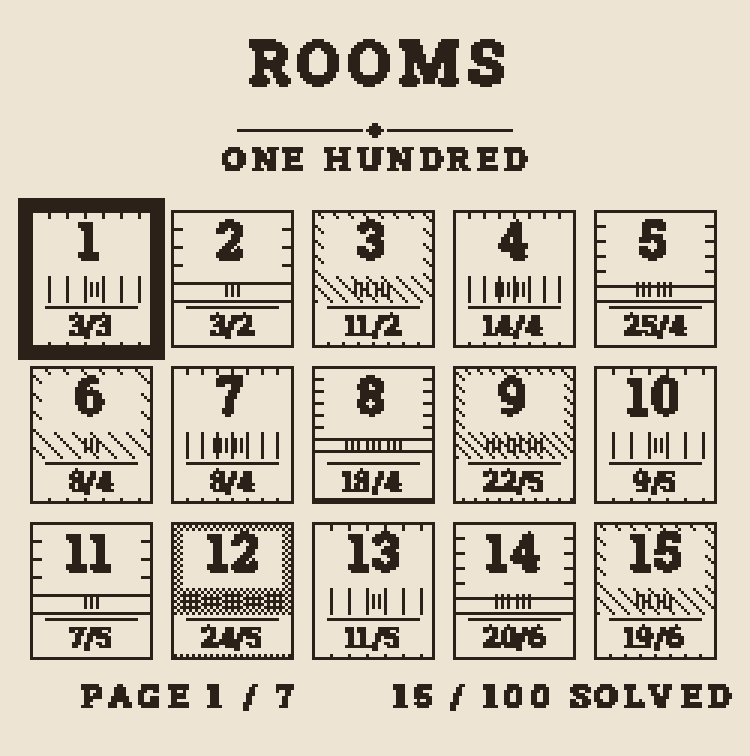
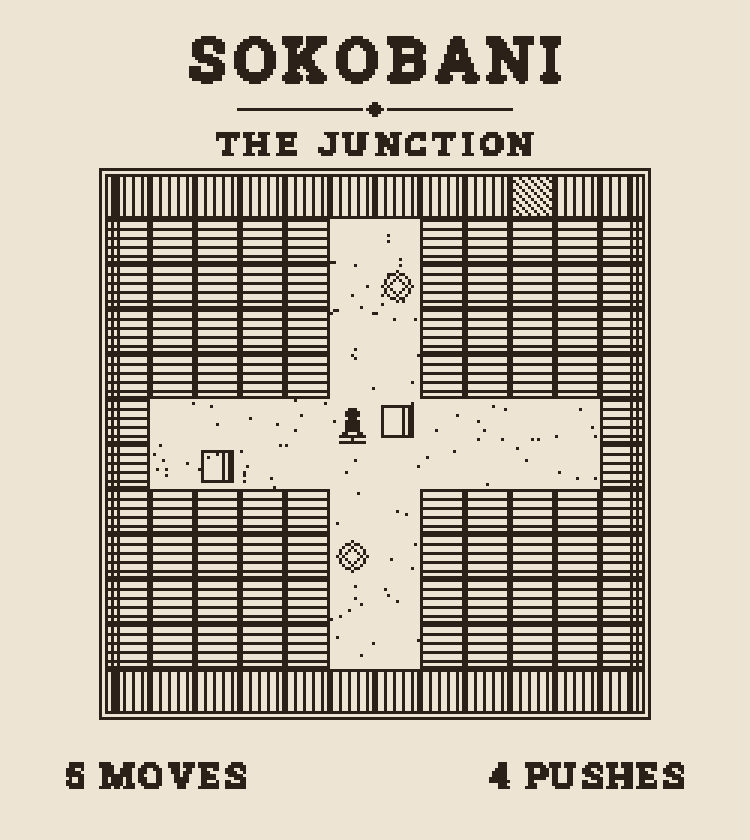
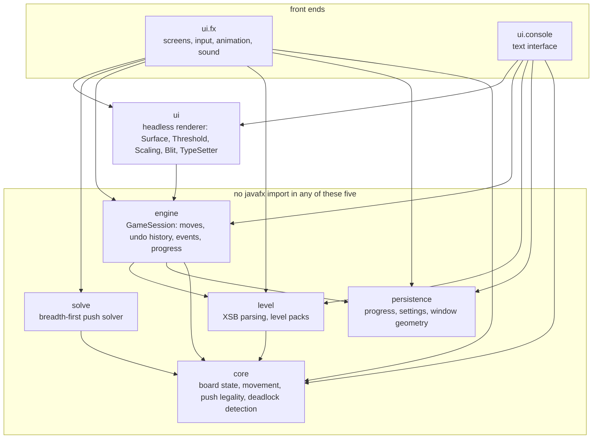

# Sokobani

A complete Sokoban game in Java. Push every box onto a goal in each of 100 rooms, and try to do it in as few moves as possible.



[](https://github.com/qnicondavid/sokobani/actions/workflows/ci.yml)
[](LICENSE)
[](https://adoptium.net)

Sokobani ships two interfaces that share one engine:

- **Desktop app** (JavaFX): a canvas-rendered game with four themes, animations, sound effects, deadlock hints and a built-in solver.
- **Console game**: the same rules, undo history and progress tracking behind a text interface.

## Features

- 100 rooms, unlocked in order as you solve them
- Per-room best records (moves / pushes), saved between runs
- Unlimited undo, restart, and next-room
- A rooms screen to jump to any unlocked room
- Deadlock hints: when a box can no longer reach any goal, the floor around it is hatched and the caption row reads `NO WAY BACK / UNDO`
- A built-in solver that plays a solved room back to you behind the main menu
- Sound effects (move, push, goal, solved) and slide animations, both toggleable
- Four ink-and-paper themes: Catalogue, Cyanotype, Bulletin, Phosphor (press `T` to cycle)
- Window size and theme remembered between launches

## Requirements

- Java 21 (the build enforces `[21,22)`)
- Maven — built and tested with 3.9

## Build and run

```bash
git clone https://github.com/qnicondavid/sokobani.git
cd sokobani
mvn -B javafx:run
```

Other entry points:

```bash
mvn -B clean verify          # compile and run the full test suite (1485 tests)
mvn -B exec:java@console     # console game
```

`mvn -B package` also writes a self-contained `target/sokobani-1.0.0-shaded.jar`, runnable with
`java -jar` on the platform it was built on.

<p align="center">
  
  
</p>

## Controls (desktop)

<p align="center">
  
</p>

| Key | Action |
| --- | --- |
| `W` `A` `S` `D` or arrows | move / push |
| `U`, `Backspace`, or `Ctrl+Z` | undo |
| `R` | restart room |
| `N` | next room (after solving) |
| `Esc` | pause / go back |
| `Enter` | confirm / play next room |
| `T` | cycle theme |
| `PgUp` / `PgDn` (or `Ctrl+W` / `Ctrl+S`, `Cmd` on macOS) | page through the room list |

## Level format

Packs are plain text in the XSB format that Sokoban levels have used for decades. A line beginning
with `;` names the room that follows; a blank line ends it.

| Character | Means |
| --- | --- |
| `#` | wall |
| ` ` | floor |
| `.` | goal |
| `$` | box |
| `*` | box already on a goal |
| `@` | player |
| `+` | player standing on a goal |

```
; First Push
#######
#@$  .#
#######
```

The bundled pack is `src/main/resources/levels/classic.sok`. To play your own, drop a `.sok` file
beside it and point `LevelRepository.CLASSIC_PACK` at it. Rooms do not need a rectangular wall
border — the parser floods outwards from the player and rejects a room only if that flood escapes.

## Console mode

```bash
mvn -B exec:java@console
```

Commands are typed at the `> ` prompt: `w a s d` to move, `u` to undo, `r` to restart,
`n` to advance to the next room, `l` to list rooms, `q` to quit, or a level number to
jump straight to a room. Here is a fresh run of the first room (output abbreviated):

```
Sokobani
Commands: w a s d move, u undo, r restart, n next level, l levels, q quit
Type a level number to play that level. Best scores are shown as moves/pushes.

Level 1/100  First Push
#######
#@$  .#
#######
moves 0   pushes 0   best none
> d
Level 1/100  First Push
#######
# @$ .#
#######
moves 1   pushes 1   best none
> d
Level 1/100  First Push
#######
#  @$.#
#######
moves 2   pushes 2   best none
> d
Level 1/100  First Push
#######
#   @*#
#######
moves 3   pushes 3   best 3/3
Solved First Push in 3 moves and 3 pushes.
Press n for the next level, or r to play this one again.
> l
Level 1/100  First Push
#######
#   @*#
#######
moves 3   pushes 3   best 3/3
Levels in classic:
>   1  First Push             3/3
    2  Corner                 none
    3  Pillar                 locked
    ... (levels 4-100 follow)
> q
```

## Where your saves live

All save data is one directory in your home folder: `~/.sokobani`
(on Windows: `%USERPROFILE%\.sokobani`).

| File | Purpose |
| --- | --- |
| `progress.json` | solved rooms and best moves/pushes |
| `settings.json` | sound, animation and hint preferences |
| `window.json` | last window geometry |
| `theme.txt` | the selected theme |

If one of the JSON files is ever unreadable, the game quarantines it (renames it to
`<name>.corrupt`) and starts fresh, so a corrupt file never blocks the game. An unreadable
`theme.txt` falls back to the default theme.

## Architecture



Every arrow is an import that exists; nothing is drawn for shape, and nothing real is left out.
`solve` hangs off `ui.fx` alone — `Solver` is imported by exactly one production file outside its own
package, `MenuScreen` — which is what "the solver drives the menu replay and nothing else" means.

`core`, `level`, `engine`, `persistence` and `solve` contain no `javafx` import at all, and compile
and run with none on the classpath. Outside `ui.fx` exactly two files touch the JavaFX canvas —
`ui.Display` and `ui.FontLoader` — and the console front end imports neither, so the whole text
interface runs on a JavaFX-free path.

That split is what makes the rules testable without a screen, and it is why the same `GameSession`
drives both front ends. The renderer draws every screen into one off-screen pixel buffer, thresholds
it to two colours and blits it at an integer scale, so a frame is an array of ints that a test can
assert on directly.

The solver is a breadth-first search over pushes. Breadth-first is what makes the push count
optimal, which is why the pack can be ordered by difficulty and why every room's solution is trusted
as a lower bound. Deadlock detection is separate and does not use it: `core.Deadlock` is
geometry-only — a box wedged between two orthogonal walls, or a box on a wall run sealed at both ends
with no goal on it — so it is cheap enough to run every frame. It is a hint rather than a rule: it
never flags a box that could still reach a goal, but it will flag one that can still be pushed along
a dead corridor, and it misses any deadlock that only becomes one two pushes later.

## Tests

`mvn -B clean verify` runs 1485 tests across 63 classes on Linux, macOS and Windows.

The JavaFX layer is tested headless through Monocle rather than skipped, so the screens, the input
routing, the tween, the sound bank and the glyph rasteriser are all exercised in CI — including
pixel-level assertions that a single base pixel blits to an exact N×N block of one colour, and that
a rendered frame contains exactly two distinct colour values.

The suite also solves all 100 bundled rooms on every run, which is how each one is verified solvable
and how its optimal push count is checked.

## Where the levels came from

Fifteen rooms are hand-made; the other eighty-five were generated for this project across ten
terrain families and selected by crate count, size and optimal push count, and every one of the
hundred is verified solvable by the repository's own solver on every test run.

## Origin

Originally built for the Object-Oriented Programming course at Maastricht University
(BSc Computer Science, first year). Since rebuilt with a JavaFX-free core, undo, level
packs, persistent progress, a terminal front end, and a test suite.

The graphics, sounds, text rendering and code are original to this project.

## Licence

MIT — see [LICENSE](LICENSE).

The bundled typeface is [Roboto Slab](https://fonts.google.com/specimen/Roboto+Slab), used under the
Apache License 2.0; its licence travels with it in
[`src/main/resources/fonts/LICENSE.txt`](src/main/resources/fonts/LICENSE.txt).
